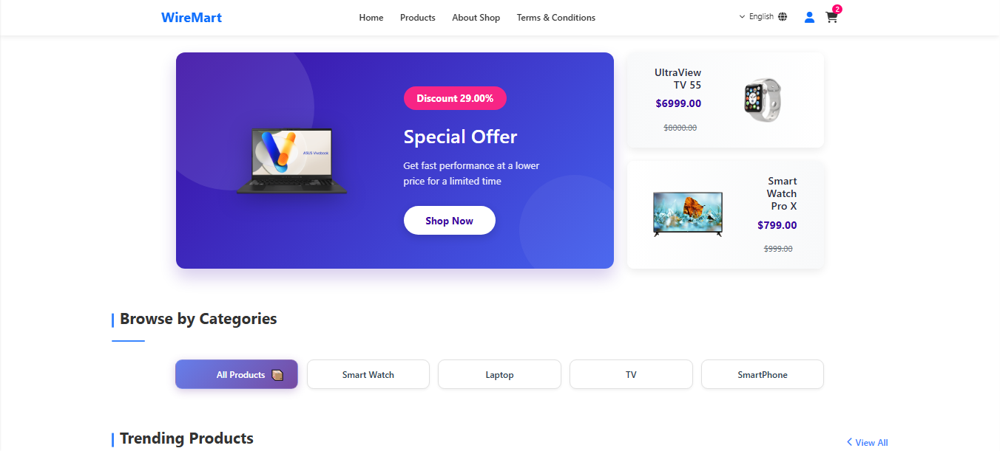
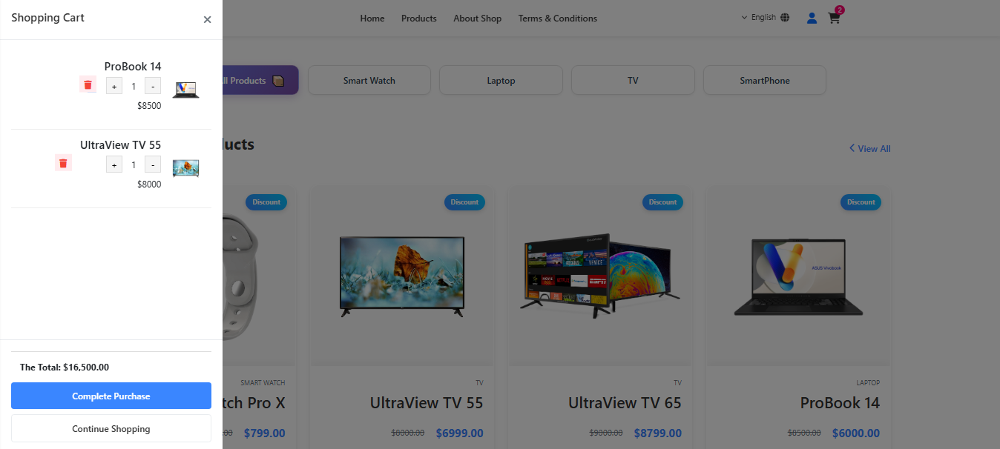

# WireMart

**WireMart** is a modern multi-role eCommerce web application built with Laravel 12, Livewire 3.0, and Breeze.  
It supports three user roles — **Admin**, **Seller**, and **Customer** — each with its own dashboard and permissions.

<p align="center">
  
  <span style="margin:0 20px;"></span>
  
</p>


---

## 🚀 Features

- 🔐 Multi-role system: Admin, Seller, Customer
- 🌐 Multi-language support: Arabic (ar), English (en), French (fr)
- 🧑‍💼 Admin dashboard with full control:
  - Manage users (sellers/customers)
  - Update homepage content (banners, offers, images)
- 🛍 Seller dashboard to manage products and view orders
- 👥 Customer dashboard for shopping, orders, and profile
- 💳 Integrated PayPal payment gateway
- 📦 Product management, categories, offers, and more
- 📈 Responsive and Bootstrap-powered UI
- ⚡ Livewire 3.0 for dynamic, real-time features
- 🧰 Built with Laravel Breeze for authentication and scaffolding

---

## 🧰 Tech Stack

<p align="center">
  
  
  
  
  
  
  
</p>

---

## 🛠 Installation

To run this project locally, follow these steps:

```bash
# 1. Clone the repository
git clone https://github.com/MahmoudSalah53/eCommerce-WireMart.git

# 2. Navigate into the project directory
cd eCommerce-WireMart

# 3. Install PHP dependencies
composer install

# 4. Create a copy of the environment file
cp .env.example .env

# 5. Generate the application key
php artisan key:generate

# 6. Run database migrations
php artisan migrate

# 7. Install frontend dependencies and compile assets
npm install && npm run dev

# 8. Create the storage symlink
php artisan storage:link

# 9. Start the local development server
php artisan serve
```

---

### If you are using the deprecated PayPal PHP REST SDK, you may encounter this error in:
```bash
vendor/paypal/rest-api-sdk-php/lib/PayPal/Common/PayPalModel.php
```
(around line 176).

Replace this code:

```bash

foreach ($param as $k => $v) {
    if ($v instanceof PayPalModel) {
        $ret[$k] = $v->toArray();
    } else if (sizeof($v) <= 0 && is_array($v)) {
        $ret[$k] = array();
    } else if (is_array($v)) {
        $ret[$k] = $this->_convertToArray($v);
    } else {
        $ret[$k] = $v;
    }
}

```
with this fixed version:

```bash

foreach ($param as $k => $v) {
    if ($v instanceof PayPalModel) {
        $ret[$k] = $v->toArray();
    } else if (is_array($v) && sizeof($v) <= 0) {
        $ret[$k] = array();
    } else if (is_array($v)) {
        $ret[$k] = $this->_convertToArray($v);
    } else {
        $ret[$k] = $v;
    }
}

```

---

## 🧪 Test PayPal Account

```env
PAYPAL_MODE=sandbox
PAYPAL_SANDBOX_CLIENT_ID=AWCwjxtosn82MLsMKuLh13FQtaB0YTyKsxUJT-1IsgUJg4EY1mG24E567Q66SO1H78XtpxJznimb9Lnl
PAYPAL_SANDBOX_SECRET=ELZLDgrfR4DoDswip9H3vE_eAsz5hM8yvpqcj0yGcK2VWZMPWAndpehR2ey2Bp1KdSultkNBqn1tnUFy
```

To test the payment functionality, use the following PayPal **Sandbox** credentials:

- **Email:** `sb-9yflv42128533@personal.example.com`  
- **Password:** `7z{?F(&t`

⚠️ *This is a sandbox (test) account — no real payments will be processed.*
